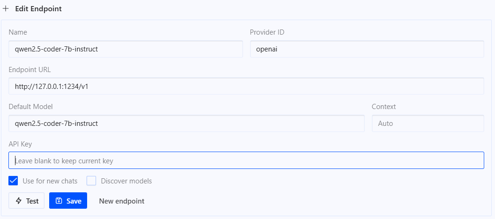

# Local-AI-Coding-Starting-Guide

During my research for local coding, I stumbled on this 4 tools. In this repo I want to present an overview of possible ways to combine them and get the best out of everything. Futermore you are welcome to try everything and leave a comment or suggestions!

This repo is meant as a continuing project, so don't see it as non plus ultra for local coding... It's an entry point for software engineers, AI engineers and many more who are interested in having the power of your coding on local machines. 

**ℹ️ Note:** LM Studio Bionics will not be covered in detail for this introduction by now. I thought it was just worth mentioning it, as alternative to Hermes Agent.

## Starting Tools

| Tool | Purpose | Description |
|---|---|---|
| **Ollama** | Local model backend (inference server) | Runs open-weight LLMs on your own hardware.|
| **LM Studio** | Local model backend (inference server) | Desktop app for browsing, downloading, and serving GGUF/MLX models with a graphical model catalog.|
| **LocalAI** | Local model backend (inference server) | Open-source (MIT) inference server that speaks the OpenAI, Anthropic, and Ollama APIs at once. Runs LLMs plus vision, voice, image, and video models on any hardware, GPU optional, with a built-in web UI and its own MCP-capable agent platform.|
| **Claude Code** | Coding agent | Anthropic's own agentic coding tool (CLI + VS Code extension). Speaks the Anthropic Messages API. By default it talks to Claude models over Anthropic's cloud API, but it can be redirected to any endpoint, including Ollama or LM Studio. |
| **Hermes Agent** | Coding / general-purpose agent | Nous Research's open-source (MIT), provider-agnostic autonomous agent. Runs as a persistent daemon with cross-session memory and self-created skills, switches between cloud and local providers with no lock-in and is able to attach to editors.|
| **LM Studio Bionic** | Standalone coding / work agent for open models | A separate app from LM Studio itself, but model downloading and management are built in, so it works on its own without needing the classic LM Studio app. Bundles its own agent harness, Code projects and Work projects, inline diffs, local codebase inspection, document/PDF/slide editing, on top of the LM Studio runtime. Runs fully local, or hands heavier tasks to LM Studio's own "Secure Cloud". |


## The Mental Model: Two Layers

The general idea of this repo is a 2 layered structure, seperated in backend and agent layer, as described in the key points below:

- **Backend layer** (the "brain"): Ollama and LM Studio load model weights and run inference.
- **Agent layer** (the "hands"): Claude Code and Hermes Agent read your repo, write patches, run terminal commands, and orchestrate multi-step work. They need a backend to think with, whether that's a cloud API or  in our case, a local server.

## General Setup

The steps below are just enough to get each tool installed and answering a first prompt. They shouldn't need to change often. Anything that changes more frequently, like  environment variables, API-compatibility flags, model recommendations, is linked to the publisher's own docs instead of copied here.

### Setup Ollama

```bash
# Install
winget install Ollama.Ollama        # Windows
brew install ollama                 # macOS
curl -fsSL https://ollama.com/install.sh | sh   # Linux

# First prompt
ollama pull llama3.2 && ollama run llama3.2
```
For further instructions look in the sources below!

### Setup LM Studio

```text
1. Download the installer for your OS from lmstudio.ai and run it
2. Open LM Studio, use the built-in search to find and download a model (e.g. "Qwen")
3. Load it and chat in the app
```
For scripting/headless use, LM Studio ships its own `lms` CLI — bootstrap it once after first launch:
```bash
~/.lmstudio/bin/lms bootstrap                            # macOS/Linux
cmd /c %USERPROFILE%/.lmstudio/bin/lms.exe bootstrap     # Windows

lms get <model-name>
lms server start
```
For further instructions look in the sources below!

### Setup LocalAI

```bash
# Install & first prompt (Docker, official quickstart)
docker run -p 8080:8080 --name local-ai -ti localai/localai:latest
```
Open `http://localhost:8080` for the web UI, or install-and-start a model in one line:
```bash
local-ai run qwen3-4b
```
For further instructions look in the sources below!

### Setup Claude Code (Locally)

```bash
# Install
npm install -g @anthropic-ai/claude-code

# First prompt, pointed at a local backend (Ollama shown here)
export ANTHROPIC_BASE_URL=http://localhost:11434
export ANTHROPIC_AUTH_TOKEN=ollama   # placeholder value, ignored by Ollama
claude --model qwen3-coder
```
For further instructions look in the sources below!

### Setup Hermes

```bash
# Install
curl -fsSL https://hermes-agent.nousresearch.com/install.sh | bash

# First prompt
hermes setup           # pick a provider interactively (local or cloud)
hermes chat -q "Hello! What tools do you have available?"
```
For further instructions look in the sources below!

## Combinations

You are free to combine the presented tools and much as you like, my intention is just to give a basic understanding of different setup possibilites and maybe give you some inspiration to explore on your own 😊!

### Ollama + Claude Code

This setup is acutally quite easy to achieve in the CLI. 

1. Open the command line interface as administrator.
2. Paste the following command with your wished model and hit enter:

```powershell
ollama launch claude --model YOURMODELHERE
```

4. For any authorization,  take a look in the sources below!

### LM Studio + Claude Code

1. Define your model with LM Studio and publish it and let the server run.
2. Set the claude environment variables to point at LM Studio, kinda like that:

```powershell
export ANTHROPIC_BASE_URL=http://localhost:1234
export ANTHROPIC_AUTH_TOKEN=lmstudio
export CLAUDE_CODE_ATTRIBUTION_HEADER=0
```

3. Let's run claude against the published model via LM Studio:

```powershell
claude --model YOURMODELHERE
```
### Ollama, LM Studio or LocalAI + Hermes Agent

1. Setup the model in the specific tool and start the local server
2. Go the model selection and select "Edit Models".
3. Click on "Add provider...".
4. Go to "Custom Endpoints" and enter the needed values for chatting with the model. Below you can see an example configuration with LM Studio and the model "qwen2.5-coder-7b-instruct":



5. Afterwards click on safe and select the model we just created.
6. Now you are able to chat with your local model 😊!

## Engine Setup in VS Code with agent registration

1. Setup the local model with your favourite provider 👾!
2. Go to VS Code and open the command palette (Strg + Shift + P) and type in "Chat: Manage Language Models". The 
3. Click on "Add Models" and select "Custom Endpoint".
4. Either enter a new group name and define the model specs or click on an existing group and select "Add Model".
5. Afterwards opens a new window with an empty config file. Enter here the id of the model, a name and the URL for the endpoint. Below is an example set up with LM Studio:

```json
{
  "id": "qwen2.5-coder-7b-instruct",
  "name": "qwen2.5-coder-7b-instruct",
  "url": "http://127.0.0.1:1234",
  "toolCalling": true,
  "vision": false,
  "maxInputTokens": 128000,
  "maxOutputTokens": 16000
}
```
Optionally you can set other options and the token handling!

## General Context Window Recommendations

Local models default to small context windows, and agentic tools burn through them fast — a system prompt plus tool definitions alone can take up a meaningful chunk before any of your code enters the conversation.

| Backend / Agent | Minimum context, per official docs |
|---|---|
| Ollama, for use with Claude Code | ≥ 32K tokens recommended |
| LM Studio, for use with Claude Code | ≥ 25K tokens recommended, more for better results |
| Hermes Agent, any backend | ≥ 64K tokens required, smaller models are rejected at startup |

## Sources

All information above is drawn from the official documentation of each publisher and some instrcution tutorials:

**Ollama**
- [Anthropic API compatibility](https://docs.ollama.com/api/anthropic-compatibility)
- [Claude Code with Anthropic API compatibility](https://ollama.com/blog/claude)
- [Ollama v0.14.0 Release Notes](https://github.com/ollama/ollama/releases/tag/v0.14.0)
- [Hermes Agent integration](https://docs.ollama.com/integrations/hermes)

**LM Studio**
- [Claude Code integration guide](https://lmstudio.ai/docs/integrations/claude-code)
- [Anthropic Compatibility Endpoints](https://lmstudio.ai/docs/developer/anthropic-compat)
- [Use your LM Studio Models in Claude Code](https://lmstudio.ai/blog/claudecode) 

**LocalAI**
- [Overview](https://localai.io/docs/overview/index.html)
- [Quickstart](https://localai.io/docs/basics/getting_started/)
- [GitHub - mudler/LocalAI](https://github.com/mudler/LocalAI)

**Anthropic / Claude Code**
- [Claude Code model configuration](https://code.claude.com/docs/en/model-config.md)

**Nous Research / Hermes Agent**
- [Hermes Agent Quickstart](https://hermes-agent.nousresearch.com/docs/getting-started/quickstart)
- [ACP Host Integration](https://hermes-agent.nousresearch.com/docs/user-guide/features/acp)
- [AI Providers Ollama / LM Studio setup](https://github.com/NousResearch/hermes-agent/blob/main/website/docs/integrations/providers.md)

**LM Studio Bionic**
- [Welcome to LM Studio Bionic](https://lmstudio.ai/docs/bionic)
- [Introducing LM Studio Bionic](https://lmstudio.ai/blog/introducing-lm-studio-bionic)

**Tutorials**
- [Tech with Tim Getting Started with Local Coding](https://youtu.be/hfba9dAT6xE?si=sFgcJiwasu9Sy4Mm)